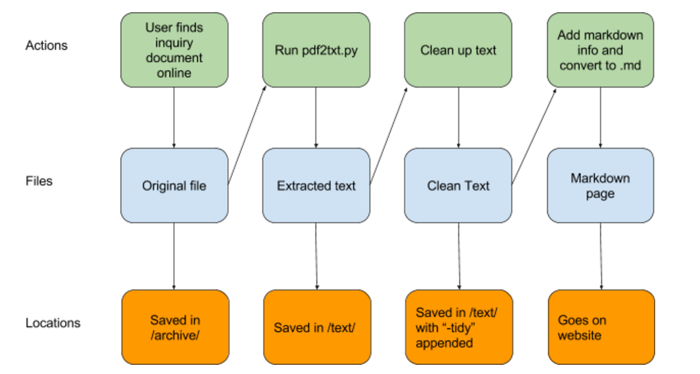

Official Inquiries collects, preserves and presents key document from official inquries in a useful and usable form.

How to contribute reports
============================

## Create a GitHub account

## Create a repository
* GitHub’s instructions for creating a repository are available [here](https://help.github.com/articles/create-a-repo/)
* Naming your repository:
  * When choosing a name for your repository, the convention we use is [name of inquiry body]-[date (yyyymmdd)]-[title].
  * Each word should be separated with a dash “-” for easy reading.
* How to structure your repository
  * Our repositories are structured as follows:
  * [repository]
    * archive
      * [archive of original source documents]
    * scripts
      *README.md (detailing any important scripts used to create the repository)
    * text
     * [text extracted from source documents]
    * README.md
    * Datapackage.json
  * To see an example, have a look at our repository on the Senate PSI report on the 2008 financial crisis [here](https://github.com/official-inquiries/senate-psi-20110403-wall-street-and-the-financial-crisis).

## Using Git to sync your repository with GitHub
* After creating the repository on GitHub, you will need to clone it to your computer. This can be done by navigating to the directory where you want to clone the repository and using the command `git clone [url of repository]`.
* Then, you can make changes to the contents of the repository on your computer. When you create a new file, use the command `git add [file path]`to add it to the list of files you would like to commit.
* When you are happy with your changes to the repository, use the command `git commit` to commit them. Don’t forget to add a brief note about the changes you are committing.
  * The formatting conventions we use for the note are [nature of note][size of changes][brief description]
  * For example: `[archive][l] added archive of original reports` to denote that you made a large change to the archive section, by adding the original reports to it.
* To sync your changes with the GitHub repository, use the command `git push` to push your changes from your local repository to the online version.
* Storing large files:
  * Sometimes, you will need to upload large files (ie larger than 50mb) to GitHub. It is not advisable to simply upload such large files as they are, so it is important to use git’s large file storage when doing so.
  * GitHub provides its own instructions on how to use lfs [here](https://github.com/github/git-lfs)
  * For example:
  After installing Git LFS, depending on your setup and preferences, run this command once per machine:
  ```
  $ git lfs install
  ```
  Now specify file patterns to store with Git LFS in `.gitattributes`:
  ```
  $ cd to/repo
  $ git init
  $ git lfs track "*.pdf"
  ```
  Commit your changes and push:
  ```
  $ git add .gitattributes
  $ git add example.pdf
  $ git commit -m "add pdf files"
  $ git push
  ```
  You can confirm that Git LFS is managing your pdf file:
  ```
  $ git lfs ls-files
  example.pdf
  ```
* Other important commands:
  * git status: at any point during the process, you can use `git status` to check the status of your local changes.
  * git pull: use `git pull` to pull changes made to the online repository and bring your local version up to date with them.

## Writing a README.md
* The purpose of the README.md is to give a basic outline of what the report contains
* The README.md should be written in _markdown_. A guide to _markdown_ and its syntax can be found [here](https://daringfireball.net/projects/markdown/).
* Have a look at some of the README.md files in the existing official-inquiries repositories to get an idea of how to structure it. Generally, it should contain:
  * An introductory paragraph, explaining what the report is.
  * A summary of the report’s contents.
  * Where you found the materials.
  * What the license for the materials is.

## Writing a datapackage.json
* The datapackage file is a convenient means of storing data about the repository.
* A guide to its use can be found [here](http://dataprotocols.org/data-packages/)
* Have a look at the datapackage.json for the Senate PSI financial crisis report [here](https://github.com/official-inquiries/senate-psi-20110403-wall-street-and-the-financial-crisis/blob/master/datapackage.json) to get an idea of the syntax and contents you will need.

## Extracting text from a .pdf
* Usually, you will have to extract text from a .pdf file of a report to get text for your _text_ directory.
To do this, we use PDFMiner
* Instructions on how to install and use PDFMiner can be found [here](http://www.unixuser.org/~euske/python/pdfminer/)

## Raising issues on GitHub
* You can raise any project issues on GitHub using the issues tab on the web interface
Or, help solve any issues listed there

Finding inquiries
===========================

If you have found an interesting official inquiry, the procedure is to add it as a github issue on the [main Official Inquiries repository](https://github.com/official-inquiries/official-inquiries/issues). The issue post should contain:

* The country of origin for the inquiry
* A synopsis of what the inquiry is
* Links to the original documents

We will focus our work on the inquiries that are likely to have the greatest public interest first. If and when an inquiry is chosen, a repository will be created for it, containing:

* A README detailing the inquiry with a summary of its contents, a list of the materials used and the license under which they are available to us.
* An /archive/ directory containing all the original files
* A data package containing relevant information about the inquiry

As an example, look at [the repository for the Levin/Coburn report into the Financial Crisis](https://github.com/official-inquiries/senate-psi-20110403-wall-street-and-the-financial-crisis)

Contributing to existing repositories
===========================

Once we have the original files for an inquiry, then we then want to end up with:

* [preserved original file] - the archive file
* [preserved original text] – the file having been put through the text extraction tool and only the text extraction tool
* [“tidy” text] – the tidied text; this can be tidied in stages, either manually or with a script
* [markdown file] – the most up-to-date “tidy” text in markdown, this goes on the site

This allows us to tidy documents in stages. The actions, files and file locations for our workflow look like this:



## Converting archive files to text
* The most simple way to help is to take files in the /archive/ directory of a repository, convert them into .txt format, and place them in the /text/ directory. We currently do this using PDFMiner. Instructions on how to install and use PDFMiner can be found [here](http://www.unixuser.org/~euske/python/pdfminer/)

## Tidying up converted text files
* Once a converted text file has been placed in the /text/ directory, the next step is to tidy the file up and fix issues that the conversion software did not pick up. The criteria for a tidy inquiry can be found just below.
* Some inquiries may have scripts which can be run to automate part or all of the tidy process. The Iraq Inquiry repository, for example, has a script in /scripts/process.py that will format footnotes and bullet points and remove unnecessary paragraph space. 

## Turning tidy text files into markdown
* The next step is to convert these text files to markdown so that they can be put up on the website.
* A file with the `.md` extension should be added to the repository's /markdown/ directory.

## Criteria for a tidy file

Each text file will vary in how it is untidy, but these are some things to look out for:

### Page information

This is needed for jekyll to read the markdown file as a webpage and so is a basic prerequisite of a tidy file. At the top of a tidy file should be:
* The page information:
  * Which html layout file in the _layout directory it uses (usually `page`)
  * The title of the page
  * `edit: true`
* The markdown table of contents. The text of the inquiry's original table of contents should be removed. 

Once you're done, the top of the page should look something like:


### Headings

* In order for markdown's table of contents to work, headings and subheadings should be formatted in markdown
* Headings should also be in standard casing, avoiding all-caps where the text conversion has produced this 

### Bullet points

* Bullet points should be formatted in markdown

### Page and paragraph numbers

* Some inquiries will have section and paragraph numbers. We generally want to keep these.
* Page numbers should be:
  * Retained, in cases where there are no paragraph or section numbers (people will want some way of knowing where to look in our reports, eg. “on paragraph/page x of the inquiry”)
    * Where  they are retained, they should be clearly separate from the text, on their own line, ideally with a line space before and after.
    * Putting the text “Page” before the number helps make it clear that the number is a page number, eg “Page 9” instead of just “9”.
  * Deprecated, in cases where there are paragraph or section numbers (these alone should provide enough guidance for users. Too many page numbers is untidy).

### Page titles

* These should be removed, usually with a simple find and replace

### Excess space

* Some inquiries, when processed, may process superfluous extra space between some lines, usually where a page break occurred in the source file. This should be removed.

### Text disorder

* Unfortunately, some inquiries [for example this inquiry’s text](https://github.com/official-inquiries/senate-psi-20110403-wall-street-and-the-financial-crisis/blob/master/text/index.md) do not process the text in the correct order.
* In this case, it can be worth trying another text extraction tool, if you are aware of one. If you have success like this, please let us know which tool you used.
    
